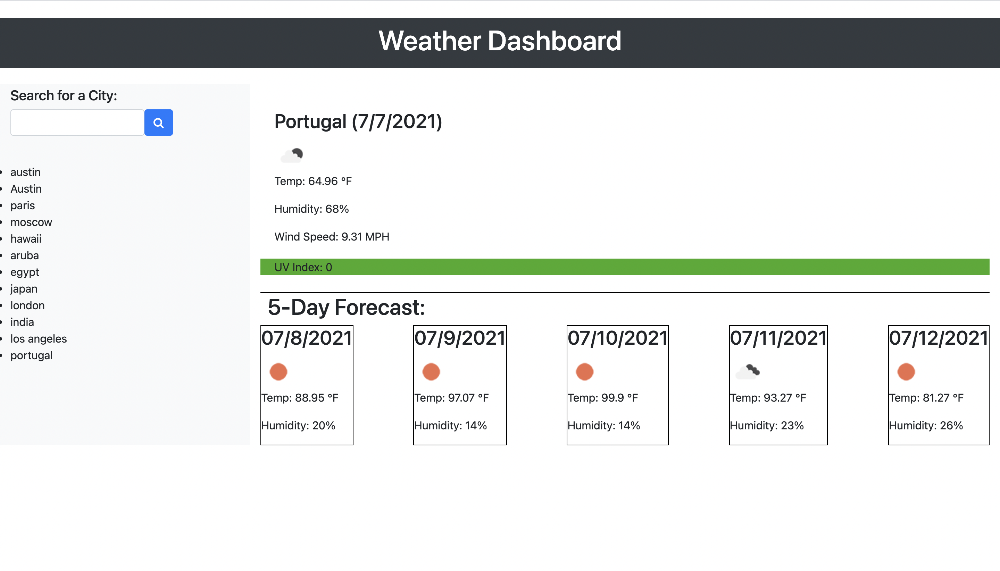

Weather Dashboard

https://glenhood.github.io/Weather-Dashboard/

I created a weather outlook for multiple cities, in order for a user can plan a trip accordingly. The dashboard has a city search funtion that provide current and future weather for that city. The search results provide the user with the city name, the date, an icon representation of weather conditions, the temperature, the humidity, the wind speed, and the UV index. When the user sees the 5-day forecast, it will display the date, an icon representation of weather conditions, the temperature, the wind speed, and the humidity. When the user clicks on a city in the search history, the user is again presented with current and future conditions for that city.
   

Credits-
www.w3schools.com was used as refrence
Robert Kurle (tutor) assisted